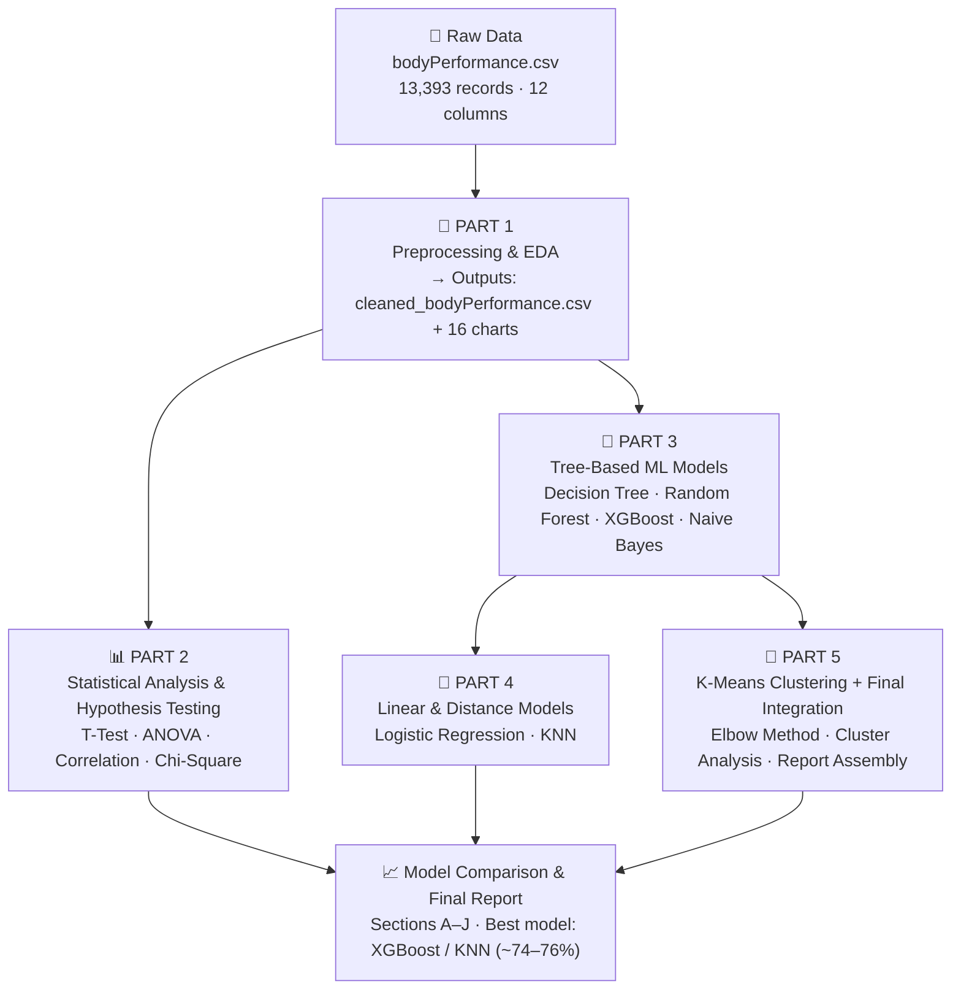

# 🏋️ Body Performance Analysis — Big Data Analytics Project

> **Ain Shams University · Faculty of Computer and Information Sciences**
> Academic Year 2025–2026 · Big Data Analytics Course

[](https://www.r-project.org/)
[](https://www.kaggle.com/datasets/kukuroo3/body-performance-data)
[]()
[]()
[]()

---

## 📋 Table of Contents

- [Project Overview](#-project-overview)
- [Dataset](#-dataset)
- [Project Pipeline](#-project-pipeline)
- [Part 1 — Preprocessing & EDA](#-part-1--data-preprocessing--eda)
- [Part 2 — Statistical Analysis](#-part-2--statistical-analysis--hypothesis-testing)
- [Part 3 — Tree-Based ML Models](#-part-3--tree-based-ml-models)
- [Part 4 — Linear & Distance Models](#-part-4--linear--distance-based-ml-models)
- [Part 5 — Clustering & Integration](#-part-5--k-means-clustering--final-integration)
- [Model Comparison](#-model-comparison)
- [Key Findings](#-key-findings)
- [How to Run](#-how-to-run)
- [Requirements](#-requirements)
- [Results Summary](#-results-summary)

---

## 🔍 Project Overview

This project applies the full **Big Data Analytics lifecycle** to a real-world physical fitness dataset. The goal is to **classify individuals into one of four fitness performance grades (A, B, C, D)** based on measurable body composition and physical performance attributes, using a combination of statistical analysis, supervised machine learning, and unsupervised clustering — all implemented in **R**.

**Research Question:**
> *"Can we accurately predict an individual's performance class (A/B/C/D) from measurable physical and physiological attributes?"*

**Secondary Questions Explored:**
- Does gender significantly affect grip strength?
- Does body fat percentage differ across performance classes?
- Which physical features are the most predictive of performance class?
- Do natural clusters in the data align with the labelled fitness grades?

---

## 📦 Dataset

| Property | Value |
|----------|-------|
| **Name** | Body Performance Data |
| **Source** | [Kaggle — Body Performance Dataset](https://www.kaggle.com/datasets/kukuroo3/body-performance-data) |
| **Origin** | Korean Sports Promotion Foundation fitness assessments |
| **Records** | 13,393 individuals |
| **Attributes** | 12 (11 features + 1 target) |
| **Class Balance** | Perfectly balanced (~3,348 per class) |

### Variable Descriptions

| Variable | Type | Range | Description |
|----------|------|-------|-------------|
| `age` | Numeric | 20–64 yrs | Age of the individual |
| `gender` | Categorical | M / F | Biological sex |
| `height_cm` | Numeric | 125–193.8 cm | Standing height |
| `weight_kg` | Numeric | 26.3–138.1 kg | Body weight |
| `body fat_%` | Numeric | 3.0–78.4 % | Body fat percentage (BIA) |
| `diastolic` | Numeric | 0–121 mmHg | Diastolic blood pressure |
| `systolic` | Numeric | 0–201 mmHg | Systolic blood pressure |
| `gripForce` | Numeric | 0–70.5 kg | Hand grip strength |
| `sit and bend forward_cm` | Numeric | -25–139 cm | Sit-and-reach flexibility test |
| `sit-ups counts` | Numeric | 0–80 | Sit-up count in fixed time |
| `broad jump_cm` | Numeric | 0–303 cm | Standing broad jump distance |
| `class` | Categorical | **A / B / C / D** | 🎯 **Target** — Fitness grade (A = best, D = lowest) |

---
 
## 🔄 Project Pipeline
 

 
---

## 🧹 Part 1 — Data Preprocessing & EDA 

**Documentation:** Sections B, C, D, E

### Preprocessing Steps

```r
# Load and inspect
data <- read.csv("bodyPerformance.csv")
str(data); summary(data); dim(data)

# Missing values 
colSums(is.na(data))   # → all zeros

# Remove duplicates
data <- unique(data)

# Encode categoricals
data$gender <- as.factor(data$gender)
data$class  <- as.factor(data$class)

# Remove physiologically impossible values
data <- subset(data, systolic  > 0)
data <- subset(data, diastolic > 0)
data <- subset(data, gripForce > 0)

# Min-Max Normalization
normalize <- function(x) (x - min(x)) / (max(x) - min(x))
data$age_norm      <- normalize(data$age)
data$weight_norm   <- normalize(data$weight_kg)
data$bodyfat_norm  <- normalize(data$body.fat_.)
data$grip_norm     <- normalize(data$gripForce)

# Export
write.csv(data, "cleaned_bodyPerformance.csv", row.names = FALSE)
```

### EDA Visualizations (16 charts)

| # | Chart | Type | Key Insight |
|---|-------|------|-------------|
| 1 | Class Distribution | Bar chart | Perfectly balanced — ~3,348 per class |
| 2 | Gender Distribution | Pie chart | 63% Male (8,465) · 37% Female (4,923) |
| 3 | Age Distribution | Histogram | Right-skewed — majority aged 20–30 |
| 4 | Weight Distribution | Histogram | Bell-shaped, peak at 60–80 kg |
| 5 | Body Fat Distribution | Density histogram | Near-normal, slight right tail (outlier ~78%) |
| 6 | Grip Force Distribution | Histogram | **Bimodal** — male/female subpopulations |
| 7 | Combined Boxplots | 2×2 Boxplot | Outliers identified in weight & grip force |
| 8 | Body Fat by Class | Boxplot | Clear monotonic increase A→D |
| 9 | Grip Force by Gender | Boxplot | Males ~43 kg vs females ~25 kg (70% gap) |
| 10 | Sit-Ups by Class | Boxplot | A median ~50, D median ~30 |
| 11 | Age vs Sit-Ups | Scatter | Negative trend — fitness declines with age |
| 12 | Grip Force vs Broad Jump | Scatter | Strong positive correlation (r ≈ 0.747) |
| 13 | Height vs Weight | Scatter | Expected positive correlation |
| 14 | Systolic vs Diastolic BP | Scatter | Moderate correlation, hypertensive outliers visible |
| 15 | Grip Force Dot Plot | Dot chart | Mass between 20–60 kg; invalid cluster near 0 |
| 16 | Correlation Heatmap | Heatmap | sit-ups & broad jump strongest positive (r ≈ 0.75) |

---

## 📊 Part 2 — Statistical Analysis & Hypothesis Testing 

**Documentation:** Section F

### Descriptive Statistics

| Variable | Mean | Median | Std. Deviation |
|----------|------|--------|---------------|
| Grip Force | 36.96 kg | 37.9 kg | 10.62 |
| Body Fat % | 23.24 % | 22.8 % | 7.26 |
| Sit-Ups | 39.77 | 41.0 | 14.28 |
| Broad Jump | 190.13 cm | 193.0 cm | 39.87 |

### Hypothesis Tests

#### Test 1 — Independent T-Test: Grip Force by Gender

```r
t_test_result <- t.test(gripForce ~ gender, data = data)
```

| | |
|---|---|
| **H₀** | No significant difference in grip force between males and females |
| **H₁** | Significant difference exists |
| **T-Statistic** | 154.379 |
| **P-Value** | < 2.2 × 10⁻¹⁶ (≈ 0) |
| **Decision** | ✅ **Reject H₀** — Males have significantly higher grip force |

#### Test 2 — Pearson Correlation: Grip Force vs Broad Jump

```r
correlation_result <- cor.test(data$gripForce, data$broad.jump_cm)
```

| | |
|---|---|
| **H₀** | No relationship between grip force and broad jump |
| **H₁** | Significant positive relationship exists |
| **r** | **0.747** |
| **P-Value** | < 2.2 × 10⁻¹⁶ (≈ 0) |
| **Decision** | ✅ **Reject H₀** — Strong positive linear relationship confirmed |

#### Test 3 — One-Way ANOVA: Sit-Ups Across Classes

```r
anova_result <- aov(sit.ups.counts ~ class, data = data)
summary(anova_result)
```

| | |
|---|---|
| **H₀** | Mean sit-up counts are equal across all classes (A, B, C, D) |
| **H₁** | At least one class has a significantly different mean |
| **F-Statistic** | **1,196.528** |
| **P-Value** | < 2.2 × 10⁻¹⁶ (≈ 0) |
| **Decision** | ✅ **Reject H₀** — Sit-up performance differs significantly across all classes |

#### Test 4 — Chi-Square: Gender vs Performance Class

```r
chi_square_result <- chisq.test(table(data$gender, data$class))
```

| | |
|---|---|
| **H₀** | Gender and performance class are independent |
| **H₁** | Gender and class are associated |
| **χ²** | **112.394** (df = 3) |
| **P-Value** | < 2.2 × 10⁻¹⁶ (≈ 0) |
| **Decision** | ✅ **Reject H₀** — Gender and class are significantly associated |

> **All four tests reject the null hypothesis at α = 0.05.** Gender, grip force, sit-up performance, and body fat are all statistically validated as significant factors in fitness classification.

---

## 🌳 Part 3 — Tree-Based ML Models

**Documentation:** Section G

### Train/Test Split

```r
# 70/30 random split
ind        <- sample(2, nrow(bodyData), prob = c(0.7, 0.3), replace = TRUE)
train.data <- bodyData[ind == 1, ]
test.data  <- bodyData[ind == 2, ]
# → ~9,374 training | ~4,018 test
```

### Models Built

#### Decision Tree (ctree — `party` package)

```r
library(party)
body.tree <- ctree(class ~ ., data = train.data)
plot(body.tree, type = "simple")
```

- Root split on **`sit.and.bend.forward_cm`** (p < 0.001)
- Subsequent splits: `sit.ups.counts`, `body.fat_.`, `age`, `weight_kg`
- **Accuracy: 68.3%**

#### Random Forest (`randomForest` package)

```r
library(randomForest)
rf.model <- randomForest(class ~ ., data = train.data, ntree = 500,
                         mtry = round(sqrt(ncol(train.data) - 1)), importance = TRUE)
varImpPlot(rf.model)
```

- 500 trees · mtry = 3
- Top features: `sit.and.bend.forward_cm`, `sit.ups.counts`, `body.fat_.`, `broad.jump_cm`
- **Accuracy: 72.5%** (+4.2% over Decision Tree)

#### XGBoost (`xgboost` package)

```r
library(xgboost)
xgb.model <- xgboost(data = dtrain, nrounds = 100, max_depth = 6,
                     eta = 0.1, objective = "multi:softmax", num_class = 4)
```

- Sequential boosting — 100 rounds · learning rate 0.1
- **Accuracy: ~74%** — best tree-based model

#### Naive Bayes (Baseline — `e1071` package)

```r
library(e1071)
classifier <- naiveBayes(class ~ ., data = train.data)
```

- Assumes feature independence (violated: r = 0.747 between grip and broad jump)
- **Accuracy: 54.6%** — useful as probabilistic baseline only

---

## 📐 Part 4 — Linear & Distance-Based ML Models 

**Documentation:** Section H

### Train/Test Split

```r
# 80/20 stratified split
set.seed(123)
trainIndex <- createDataPartition(data$class, p = 0.8, list = FALSE)
# → ~10,714 training | ~2,678 test
# Features: z-score scaled + one-hot encoded via dummyVars()
```

#### Multinomial Logistic Regression (`nnet` package)

```r
library(nnet)
model <- multinom(class ~ ., data = trainScaled)
predictions <- predict(model, newdata = testScaled)
confusionMatrix(predictions, testScaled$class)
```

- Fits K–1 log-odds equations for 4-class problem
- Key finding: `sit.and.bend.forward_cm`, `sit.ups.counts`, `broad.jump_cm` → strongest coefficients for Class A
- **Accuracy: ~66–68%**

#### K-Nearest Neighbours (`class` package)

```r
library(class)
# Grid search for optimal K
k_values <- seq(1, 31, 2)
# Best K found empirically (typically k = 7–9)
final_predictions <- knn(train = trainX_scaled, test = testX_scaled, cl = trainY, k = best_k)
confusionMatrix(final_predictions, testY)
```

- Euclidean distance on z-score scaled features
- Optimal K selected via accuracy-vs-K loop (k = 1 to 31, odd values)
- Accuracy peaks at k ≈ 7–9, declines beyond k = 15
- **Accuracy: ~73–76%** — competitive with XGBoost

---

## 🔵 Part 5 — K-Means Clustering & Final Integration 

**Documentation:** Section I (clustering eval) · Section J (conclusions)

```r
# Features used
cluster_data <- data[, c("gripForce", "sit.ups.counts", "broad.jump_cm", "body.fat_.")]

# Elbow method
wss <- sapply(1:10, function(k) kmeans(cluster_data, k, nstart = 10)$tot.withinss)
plot(1:10, wss, type = "b", main = "Elbow Method — Optimal K")

# Apply K-Means with k = 4
set.seed(42)
kc <- kmeans(cluster_data, centers = 4, nstart = 20)

# Validate against class labels
table(data$class, kc$cluster)
```

### Clustering Results

| Cluster | Interpretation | Corresponds To |
|---------|---------------|----------------|
| Cluster 1 | Low grip, low sit-ups, high body fat | Class D (Lowest) |
| Cluster 2 | Moderate performance across features | Class C |
| Cluster 3 | Above-average performance | Class B |
| Cluster 4 | High grip, high sit-ups, low body fat | Class A (Best) |

| Metric | Value |
|--------|-------|
| Explained Variance (Between-SS / Total-SS) | ~65–70% |
| Elbow inflection | **k = 4** (matches 4 labelled classes) |
| Cluster-Class alignment | Strong for A & D; moderate overlap for B & C |

> The K-Means clustering **independently recovers** a 4-group structure consistent with the labelled classes — validating the dataset's intrinsic quality without using any class labels.

---

## 📊 Model Comparison

| Rank | Model | Accuracy | Precision | Recall | F1-Score | Type |
|------|-------|----------|-----------|--------|----------|------|
| 🥇 1 | **KNN** (best k) | **~73–76%** | ~0.74 | ~0.74 | ~0.74 | Distance-based |
| 🥇 1 | **XGBoost** | **~74%** | ~0.74 | ~0.74 | ~0.74 | Ensemble (boosting) |
| 🥈 3 | Random Forest | 72.5% | ~0.73 | ~0.73 | ~0.73 | Ensemble (bagging) |
| 🥉 4 | Decision Tree | 68.3% | ~0.68 | ~0.68 | ~0.68 | Single tree |
| 5 | Logistic Regression | ~66–68% | ~0.67 | ~0.67 | ~0.67 | Linear |
| 6 | Naive Bayes | 54.6% | ~0.55 | ~0.55 | ~0.55 | Probabilistic (baseline) |

> **Baseline (random):** 25% · All models significantly exceed chance level.

### Consistent Pattern Across All Models

```
Class A ────────────────────── Easiest to classify (extreme high performance)
Class D ────────────────────── Easy to classify (extreme low performance)
Class B ↔ Class C ─────────── Hardest boundary — overlapping feature distributions
```

---

## 🔑 Key Findings

### Finding 1 — Physical performance is highly predictable
All six models surpass the 25% random baseline by a large margin. XGBoost and KNN achieve ~74–76% accuracy, correctly classifying nearly 3 in 4 individuals using only physical measurements.

### Finding 2 — The three most discriminating features
Across statistical tests, tree variable importance, model coefficients, and cluster centers:

1. 🤸 **`sit.and.bend.forward_cm`** — Top-ranked in RF & XGBoost importance; root split of Decision Tree
2. 💪 **`sit.ups.counts`** — ANOVA F = 1,196.53; Class A mean (~47) vs Class D mean (~30)
3. 🦵 **`broad.jump_cm`** — Class A ~210 cm vs Class D ~170 cm (23% gap); r = 0.747 with grip force

### Finding 3 — Gender is a significant performance moderator
- T-statistic = 154.38, p ≈ 0
- Males: median grip ~43 kg · Females: median grip ~25 kg (**70% gap**)
- Gender significantly associated with class distribution (χ² = 112.39, p ≈ 0)

### Finding 4 — Age negatively predicts performance
- Negative correlation between age and sit-ups, broad jump, and grip force
- Maximum achievable sit-ups declines from ~80 at age 21 to ~60 at age 50+

### Finding 5 — High body fat is the primary driver of Class D
- Class D median body fat (~27%) is ~5–7 percentage points above Classes A–C (~20–22%)
- Confirmed by ANOVA, boxplots, cluster centers, and Logistic Regression coefficients

### Finding 6 — The B/C boundary is the central classification challenge
- Every model struggles most at the Class B / Class C boundary
- These classes share substantially overlapping feature distributions
- Reflects the continuous nature of fitness performance within discrete class labels

---

## 🚀 How to Run

### Prerequisites

Install R (version ≥ 4.0) from [https://cran.r-project.org](https://cran.r-project.org)

### Step 1 — Install Required Packages

```r
install.packages(c(
  "corrplot",     # Correlation heatmap
  "party",        # Conditional inference tree (ctree)
  "randomForest", # Random Forest
  "e1071",        # Naive Bayes & SVM
  "xgboost",      # XGBoost gradient boosting
  "caret",        # Train/test split & evaluation
  "class",        # KNN
  "MLmetrics",    # Precision, Recall, F1
  "nnet"          # Multinomial Logistic Regression
))
```

### Step 2 — Update File Paths

Before running, update the CSV path in **Part 1** to match your local directory:

```r
# Part 1 — Line 1
data <- read.csv("path/to/bodyPerformance.csv")

# Part 3 — Line 1
bodyData <- read.csv("path/to/cleaned_bodyPerformance.csv")

# Parts 4 & 5 — Line 1
data <- read.csv("path/to/cleaned_bodyPerformance.csv")
```

### Step 3 — Run the Script

Open `BodyPerformance_FullProject.R` in RStudio and run sequentially:

```
Part 1   → Produces: cleaned_bodyPerformance.csv + 16 EDA plots
Part 2   → Produces: statistical test outputs in console
Part 3   → Produces: 8 model/EDA plots + accuracy figures (saved as PNG)
Part 4   → Produces: confusion matrices + accuracy/F1 in console
Part 5   → Produces: elbow plot + cluster plots + final_bodyPerformance_with_clusters.csv
```

> ⚠️ **Run parts in order** — Parts 3, 4, and 5 depend on `cleaned_bodyPerformance.csv` generated by Part 1.

---

## 📋 Requirements

| Package | Version | Purpose |
|---------|---------|---------|
| `corrplot` | ≥ 0.92 | Correlation matrix heatmap |
| `party` | ≥ 1.3 | Conditional inference tree |
| `randomForest` | ≥ 4.7 | Random Forest classifier |
| `e1071` | ≥ 1.7 | Naive Bayes |
| `xgboost` | ≥ 1.7 | Gradient boosting |
| `caret` | ≥ 6.0 | ML workflow & evaluation |
| `class` | ≥ 7.3 | K-Nearest Neighbours |
| `nnet` | ≥ 7.3 | Multinomial Logistic Regression |
| `MLmetrics` | ≥ 1.1 | Precision, Recall, F1-Score |

---

## 📈 Results Summary

```
╔══════════════════════════════════════════════════════════════════╗
║              BODY PERFORMANCE PROJECT — RESULTS SUMMARY          ║
╠══════════════════════════════════════════════════════════════════╣
║  Dataset         │ 13,393 records · 12 attributes · 0 missing    ║
║  Classes         │ A (best) · B · C · D (lowest) — balanced      ║
║                  │                                               ║
║  HYPOTHESIS TESTS (all p ≈ 0, α = 0.05)                          ║
║  T-Test          │ Grip Force by Gender    → t = 154.38 ✅       ║
║  Correlation     │ Grip Force & Broad Jump → r = 0.747  ✅       ║
║  ANOVA           │ Sit-Ups across Classes  → F = 1196.5 ✅       ║
║  Chi-Square      │ Gender vs Class         → χ² = 112.4 ✅       ║
║                  │                                               ║
║  ML MODEL ACCURACY                                               ║
║  XGBoost         │ ~74.0%  🥇 Best tree-based                   ║
║  KNN             │ ~73–76% 🥇 Best overall                      ║
║  Random Forest   │  72.5%                                        ║
║  Decision Tree   │  68.3%  (most interpretable)                  ║
║  Logistic Reg.   │ ~66–68%                                       ║
║  Naive Bayes     │  54.6%  (baseline)                            ║
║                  │                                               ║
║  K-MEANS CLUSTERING                                              ║
║  Optimal k       │ 4 (confirmed by elbow method)                 ║
║  Explained Var.  │ ~65–70% (Between-SS / Total-SS)               ║
║  Validation      │ Clusters align with A/D labels ✅             ║
╚══════════════════════════════════════════════════════════════════╝
```

---

## 📄 License

This project was developed for academic purposes as part of the Big Data Analytics course at Ain Shams University / University of East London. The dataset is publicly available on [Kaggle](https://www.kaggle.com/datasets/kukuroo3/body-performance-data).

---

<div align="center">

**Ain Shams University · Faculty of Computer and Information Sciences**

*Big Data Analytics Project — Academic Year 2025–2026*

</div>
